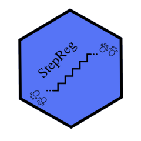

# StepReg
---
- #### An R package for stepwise regression analysis
---



## Table of Contents
[1. Introduction](#1-introduction)
- [Feature selection](#feature-selection)
- [Stepwise regression](#stepwise-regression)

[2. Algorithms implemented in StepReg](#2-algorithms-implemented-in-stepreg)
- [Stepwise algorithms](#stepwise-algorithms)
- [Best Subsets algorithm](#best-subsets-algorithm)
- [Selection criterion](#selection-criterion)
- [Multicollinearity](#multicollinearity)

[3. Usage and examples](#3-usage-and-examples)

[4. Validation](#4-validation)

[5. Support](#5-support)

[6. How to cite](#6-how-to-cite)

## 1. Introduction

### Feature selection

For a dataset with many input variables, aka predictors, it is wise to reduce the number of fields (a procedure known as feature selection) before feeding it into a model. There are at least three benefits:
  - *Fewer predictors increase the interpretability of the model;*
  - *Removal of non-informative variables lowers the chance of overfitting;*
  - *It is more computation friendly.*

There are multiple methods for feature selection serving different tasks. For regression models, commonly used strategies include stepwise and best subsets. Below discusses more details.

### Stepwise regression

Stepwise regression is a common technique used for automatically selecting the optimal predictive variables to determine an optimal model. It works by **iteratively (step-by-step) adding or removing potential explanatory variables in sequence** and testing for improvement in terms of statistical significance. It repeats this process until no more improvement can be observed. As a result, the stepwise selection procedure eliminates variables irrelevant to the regression model and only includes statistically relevant ones.

**StepReg** currently supports three regression models: linear regression, logistic regression, and Cox regression.

## 2. Algorithms implemented in StepReg

### Stepwise algorithms

Stepwise regression aims to identify the subset of predictor variables that provide the best predictive performance for the response variable in a step-by-step fashion. There are three methods: *Forward Selection*, *Backward Elimination*, and *Bidirectional Elimination*.

- **Forward Selection**

In forward selection, the algorithm starts with an empty model (no predictors) and adds in variables one by one. Each step tests the addition of every possible predictor by calculating a pre-selected model fit score. Add the variable (if any) whose inclusion leads to the most statistically significant fit improvement. Repeat this process until more predictors no longer lead to a statistically better fit.

- **Backward Elimination**

In backward elimination, the algorithm starts with a full model (all predictors) and deletes variables one by one. Each step test the deletion of every possible predictor by calculating a pre-selected model fit score. Delete the variable (if any) whose loss leads to the most statistically significant fit improvement. Repeat this process until less predictors no longer lead to a statistically better fit.

- **Bidirectional Elimination**

Bidirectional elimination is essentially a forward selection procedure combined with backward elimination at each iteration. Each iteration starts with a forward selection step that adds in predictors, followed by a round of backward elimination that removes predictors. Repeat this process until no more predictors are added or excluded.

### Best Subsets algorithm

Stepwise algorithms add or delete one predictor at a time and output a single model without evaluating all candidates. Therefore, it is a relatively simple procedure that only produces one model. In contrast, the *Best Subsets* algorithm calculates all possible models and presents the best-fitting models with one predictor, two predictors, three predictors, and more. The user must determine the best model.

### Selection criterion

The *selection criterion* is another name for the aforementioned *model fit score*. It is a means of evaluating a model's quality by estimating its predictive performance. The following selection criteria have been implemented in StepReg:
- For linear regression (based on F-test or Approximate F-test):
  - AIC: Akaike information criterion
  - AICc: sample-size adjusted AIC
  - BIC: Bayesian information criterion
  - Mallows's Cp
  - HQ: Hannan-Quinn information criterion
  - HQc: Corrected Hannan and Quinn information criterion, reference see [here](https://www.jstatsoft.org/article/view/v007i12)
  - Rsq: R-squared
  - adjRsq: adjusted Rseq
  - SBC: Schwarz information criterion
  - SL (Pvalue): Significance level
- For logistic regression
  - the score test
  - the Wald test

### Multicollinearity

This [blog](https://statisticsbyjim.com/regression/multicollinearity-in-regression-analysis/) by Jim Frost gives an excellent overview of multicollinearity and when it is necessary to remove it.

Simply put, a dataset contains multicollinearity when input predictors are correlated. When multicollinearity occurs, the interpretability of predictors will be badly affected because changes in one input variable lead to changes in other input variables. Therefore, it is hard to individually estimate the relationship between each input variable and the dependent variable.

Multicollinearity can dramatically reduce the precision of the estimated regression coefficients of correlated input variables, making it hard to find the correct model. However, as Jim pointed out, “*Multicollinearity affects the coefficients and p-values, but it does not influence the predictions, precision of the predictions, and the goodness-of-fit statistics. If your primary goal is to make predictions, and you don’t need to understand the role of each independent variable, you don’t need to reduce severe multicollinearity.*”

In StepReg, [QC Matrix Decomposition](https://towardsdatascience.com/qr-matrix-factorization-15bae43a6b2#:~:text=The%20QR%20matrix%20decomposition%20allows%20one%20to%20express%20a%20matrix,zero%2C%20it%20is%20also%20invertible.) is performed ahead of time to detect and remove input variables causing multicollinearity.

## 3. Usage and examples

#### Installation of StepReg
```
install.packages("StepReg")
library(StepReg)
```
Developer's version:
```
library(devtools)
install_github("JunhuiLi1017/StepReg")
```

#### Getting help
```
help(package = "StepReg")
# Or
?StepReg

?stepwise
?stepwiseCox
?stepwiseLogit
```

### Examples

#### Stepwise linear regression
```
# remove intercept and add new variable yes which is the same as variable wt in mtcars dataset

data(mtcars)
mtcars$yes <- mtcars$wt
formula    <- cbind(mpg,drat) ~ . + 0
stepwise(formula    = formula,
         data       = mtcars,
         selection  = "bidirection",
         select     = "AIC")
```

#### Stepwise logistic regression
```
formula=vs ~ .
stepwiseLogit(formula,
              data      = mtcars,
              selection = "bidirection",
              select    = "SL",
              sle       = 0.15,
              sls       = 0.15)
```

#### Stepwise Cox regression
```
lung <- survival::lung
my.data <- na.omit(lung)
my.data$status1 <- ifelse(my.data$status==2,1,0)
data <- my.data
formula = Surv(time, status1) ~ . - status

stepwiseCox(formula     = formula,
            data        = data,
            selection   = c("bidirection"),
            select      = "SL",
            sle         = 0.15,
            sls         = 0.15)
```

## 4. Validation

  - Output from StepReg for multivariate stepwise regression was cross-validated with the reference. (see [publications](#publications))

  - Final results using StepReg for three datasets are consistent with that using SAS software.
    - Dataset1 without class effect: 13 dependent variable, 129 independent variable, and 216 samples.
    - Dataset2 with 4 class effect: 12 dependent variable, 1270 independent variable, and 647 samples.
    - Dataset3 with 6 class effect: 5 dependent variable, 2068 independent variable, and 412 samples.

## 5. Support
For bug reports and feature requests, raise an [issue](https://github.com/JunhuiLi1017/StepReg/issues/new).

## 6. How to cite

### Publications
Please kindly cite the following publications if you find **StepReg** useful:
  - journal: [to be added]
  - bioRxiv: [to be added]
  - R CRAN package: https://cran.r-project.org/web/packages/StepReg/
  - Zenodo page: [to be added]
